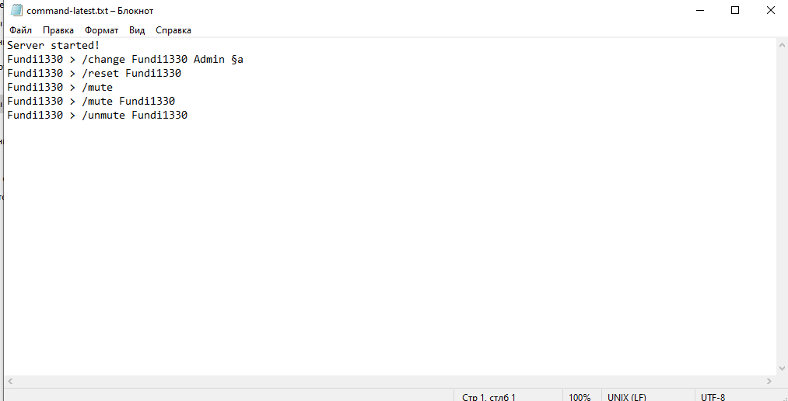
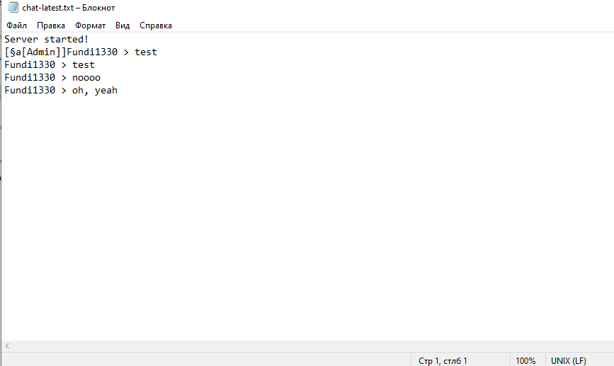

# Chat manager
Chat manager is a powerful plugin for making what you want with chat. It is a port of Java Chat Manager.
# Features:
* Local and global chat system
* Good and flexy configuration
* Banwords system
* Simple chat-bot
* Prefix system
* Anti-caps
* Simple mute system
* Message lenght limit
# Todo list:
* Improve auto-moderation
* commands(only mute finished)
* chat formating and editing(like clearing chat, grammar, etc.)
* improve chat bot
* imrpove logs
* moderation
* custom messages
* and other features
# Screenshots:
 
 
 
 
 
 
 

